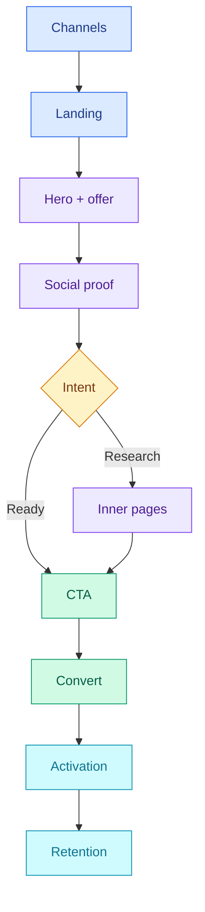

# Markdown to PDF

Mobile-friendly Markdown to PDF in your browser with GFM, syntax highlighting, and Mermaid. Works offline; nothing is uploaded for conversion.

[](https://md2pdf.marcopontili.com)

Live app: **[md2pdf.marcopontili.com](https://md2pdf.marcopontili.com)**

## Acknowledgements

This repository is derived from **[realdennis/md2pdf](https://github.com/realdennis/md2pdf)** (MIT). Thanks to Dennis for the original app.

This fork is maintained on its own track: **Mermaid** preview, **GFM** + highlighted code, offline **PWA**, tighter sanitization, print-friendly styling, **CI/deploy**, and tests.

---

## Features

- Convert Markdown to PDF via the browser print dialog
- **100% offline**: works without internet after first load
- **Client-only workflow**: no backend; Markdown is rendered and printed from your browser session
- **Privacy-friendly**: conversion runs locally; nothing is sent to an app server for processing
- **Responsive / mobile**: tabbed **Editor** and **Preview** on narrow viewports; split editor + preview on desktop
- PWA support (installable, cache-first for repeat visits)
- Custom styles for PDF output (GitHub-style markdown CSS)
- Instant live preview and syntax-highlighted code blocks
- Mermaid diagrams from fenced `mermaid` code blocks
- Import `.md` files via button or drag-and-drop

## Tech Stack

- **React 19** with Vite
- **styled-components** for styling
- **CodeMirror 6** (`@uiw/react-codemirror`) for the editor
- **react-markdown** + **remark-gfm** + **highlight.js** for markdown rendering
- **vite-plugin-pwa** (Workbox-powered) for the service worker (offline/caching)
- **nonaction** for minimal state

## Security

- **Local-first / privacy**: Markdown and preview live in your browser; there is no backend that receives your document for conversion.
- **No raw HTML in markdown**: the preview renders markdown only; raw HTML in `.md` is not executed, which prevents XSS from untrusted content.
- **Strict file handling**: only `.md` files are accepted on import; content is read with the File API and never sent over the network.
- **Security headers**: when served with Apache, the app uses safe defaults (e.g. `X-Content-Type-Options: nosniff`, no directory listing, blocked access to hidden and backup files). Optional headers (X-Frame-Options, Referrer-Policy) are documented in `public/.htaccess`.

## Installation

1. Clone the repository:

   ```bash
   git clone https://github.com/marcop135/md2pdf.git
   cd md2pdf
   ```

2. Install dependencies:

   ```bash
   npm install
   ```

3. Run locally:

   ```bash
   npm start
   ```

   Then open [http://localhost:5173](http://localhost:5173); the terminal also prints the **`Local:`** URL.

   If startup fails because **5173 is in use**, another process already bound that port (often a stray Vite terminal). Quit that session or kill the orphaned process so the app serves on **5173** consistently.

4. Production build:

   ```bash
   npm run build
   ```

   Output is in the `dist/` folder. Serve it with any static host (e.g. Apache, Nginx, or a static hosting service). For Apache, copy `public/.htaccess` to the root of the deployed site for recommended security and caching.

## Usage

- Type or paste Markdown in the editor.
- Use the **Preview** tab (on mobile) or the right panel (on desktop) to see the rendered result.
- Click **Export to .pdf** to open the print dialog; choose “Save as PDF” (or equivalent) to get a PDF. The suggested filename comes from the first markdown heading.
- Use **Import .md file** or drag-and-drop a `.md` file to load its content.

Mermaid example (marketing-site flow):



## Project Structure

| Path                  | Description                                                |
| --------------------- | ---------------------------------------------------------- |
| `src/`                | Application source                                         |
| `src/App/`            | Root component, containers, layout                         |
| `src/App/Components/` | Header, Markdown editor, preview, drag bar                 |
| `src/App/Container/`  | State (nonaction), hooks (e.g. useIsMobile, useDrop)       |
| `src/App/Lib/`        | Utilities (e.g. upload helper)                             |
| `public/`             | Static assets (`.htaccess`, `manifest.json`, `robots.txt`) |
| `dist/`               | Production output (after `npm run build`)                  |

## Scripts

| Command                 | Description                                              |
| ----------------------- | -------------------------------------------------------- |
| `npm start`             | Development server                                       |
| `npm run build`         | Production build                                         |
| `npm test`              | Run tests                                                |
| `npm run preview`       | Preview production build (`dist/`)                       |
| `npm run hero:sync`     | Render social-preview SVGs to PNGs (og:image + GitHub repo card) |
| `npm run changelog:lint`| Validate `CHANGELOG.md` formatting                       |

## Contributing

Contributions welcome! Please read [CONTRIBUTING.md](./CONTRIBUTING.md) for guidelines on how to contribute.

- Found a bug? [Open an issue](https://github.com/marcop135/md2pdf/issues)
- Have a feature request? [Open an issue](https://github.com/marcop135/md2pdf/issues)
- Want to contribute? [Read the contributing guide](./CONTRIBUTING.md)

## License

Licensed under the [MIT](./LICENSE) License.
