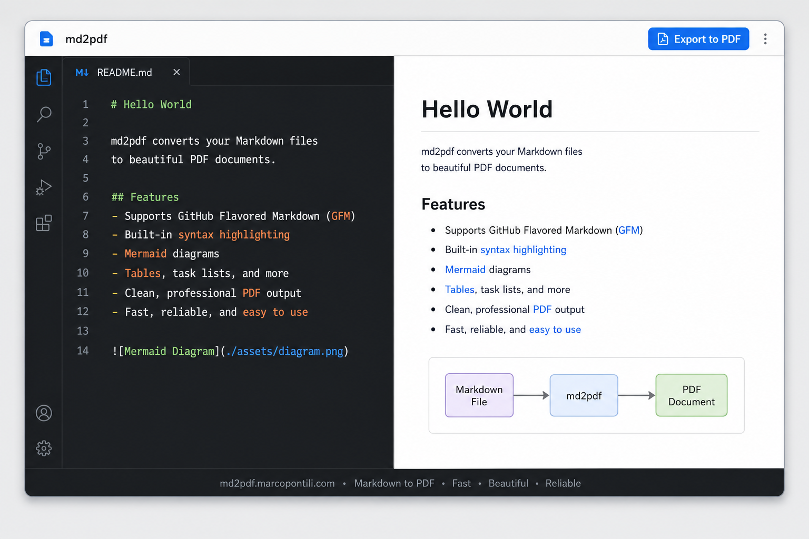
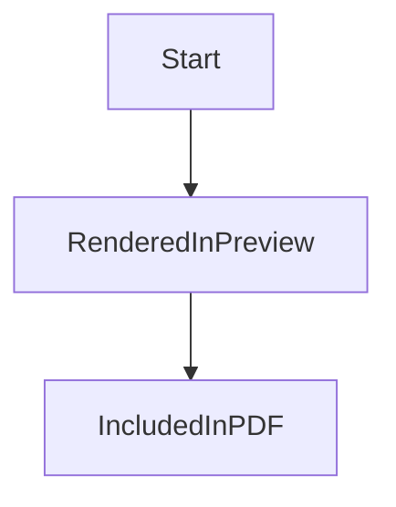

# Markdown2PDF

Turn Markdown into a print-ready PDF in your browser: **live GitHub-flavored preview**, **syntax-highlighted** fenced code blocks, and **Mermaid** diagrams. Works **offline as a PWA** after the first load; processing stays in the browser (no separate backend).

<p align="center">
  
</p>

Live app: **[md2pdf.marcopontili.com](https://md2pdf.marcopontili.com)**

## Acknowledgements

This repository is derived from **[realdennis/md2pdf](https://github.com/realdennis/md2pdf)** (MIT). Thanks to Dennis for the original app.

This fork evolves the codebase independently: **Mermaid** in the preview, **remark-gfm** + **highlight.js**, **vite-plugin-pwa** / offline caching, stricter sanitization paths, UX and PDF-oriented styling, CI build + deploy automation, tests, and ongoing maintenance.

---

## Features

- Convert Markdown to PDF via the browser print dialog
- **100% offline**: works without internet after first load
- **Client-only workflow**: no backend; Markdown is rendered and printed from your browser session
- Responsive UI with a **mobile-friendly** tabbed editor/preview on small screens
- PWA support (installable, cache-first for repeat visits)
- Custom styles for PDF output (GitHub-style markdown CSS)
- Instant live preview and syntax-highlighted code blocks
- Mermaid diagrams from fenced `mermaid` code blocks
- Import `.md` files via button or drag-and-drop
- Hidden from search engines (`noindex`, `robots.txt`)

## Tech Stack

- **React 19** with Vite
- **styled-components** for styling
- **CodeMirror 6** (`@uiw/react-codemirror`) for the editor
- **react-markdown** + **remark-gfm** + **highlight.js** for markdown rendering
- **vite-plugin-pwa** (Workbox-powered) for the service worker (offline/caching)
- **nonaction** for minimal state

## Security

- **Client-side only**: no backend; nothing is uploaded or stored on a server.
- **No raw HTML in markdown**: the preview renders markdown only; raw HTML in `.md` is not executed, which prevents XSS from untrusted content.
- **Strict file handling**: only `.md` files are accepted on import; content is read with the File API and never sent over the network.
- **Security headers**: when served with Apache, the app uses safe defaults (e.g. `X-Content-Type-Options: nosniff`, no directory listing, blocked access to hidden and backup files). Optional headers (X-Frame-Options, Referrer-Policy) are documented in `public/.htaccess`.

## Installation

1. Clone the repository:

   ```bash
   git clone https://github.com/marcop135/md2pdf.git
   cd md2pdf
   ```

2. Install dependencies:

   ```bash
   yarn install
   ```

3. Run locally:

   ```bash
   yarn start
   ```

   Then open [http://localhost:5173](http://localhost:5173).

4. Production build:

   ```bash
   yarn build
   ```

   Output is in the `dist/` folder. Serve it with any static host (e.g. Apache, Nginx, or a static hosting service). For Apache, copy `public/.htaccess` to the root of the deployed site for recommended security and caching.

## Usage

- Type or paste Markdown in the editor.
- Use the **Preview** tab (on mobile) or the right panel (on desktop) to see the rendered result.
- Click **Export to .pdf** to open the print dialog; choose “Save as PDF” (or equivalent) to get a PDF.
- Use **Import .md file** or drag-and-drop a `.md` file to load its content.

Mermaid example:



## Project Structure

| Path                  | Description                                                |
| --------------------- | ---------------------------------------------------------- |
| `src/`                | Application source                                         |
| `src/App/`            | Root component, containers, layout                         |
| `src/App/Components/` | Header, Markdown editor, preview, drag bar                 |
| `src/App/Container/`  | State (nonaction), hooks (e.g. useIsMobile, useDrop)       |
| `src/App/Lib/`        | Utilities (e.g. upload helper)                             |
| `public/`             | Static assets (`.htaccess`, `manifest.json`, `robots.txt`) |
| `dist/`               | Production output (after `yarn build`)                     |

## Scripts

| Command        | Description                        |
| -------------- | ---------------------------------- |
| `yarn start`   | Development server                 |
| `yarn build`   | Production build                   |
| `yarn test`    | Run tests                          |
| `yarn preview` | Preview production build (`dist/`) |

## Contributing

1. Fork the repository.
2. Create a branch: `git checkout -b feature/your-feature`.
3. Commit: `git commit -m 'Describe your feature'`.
4. Push: `git push origin feature/your-feature`.
5. Open a pull request.

## Brand images

- [`docs/readme-hero.png`](docs/readme-hero.png) banner used at the top of this README (UI mockup of the editor and preview).
- [`docs/github-social-preview.png`](docs/github-social-preview.png) for the repository share card on GitHub: **Settings → General → Social preview → Edit** and upload this file (wide image, suitable for repo links and Open Graph-style previews).

## License

MIT
