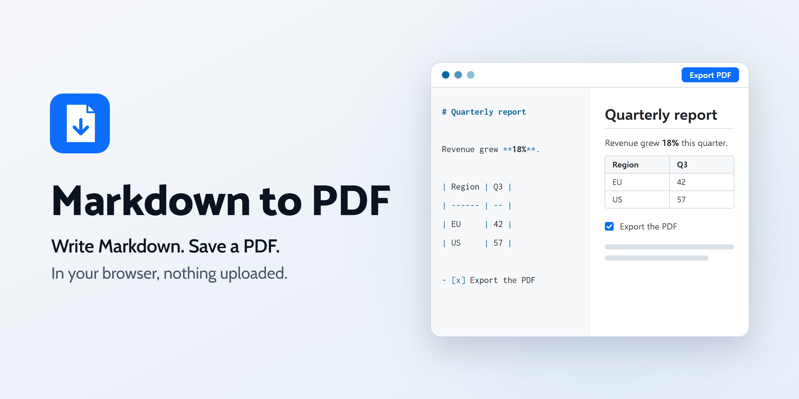
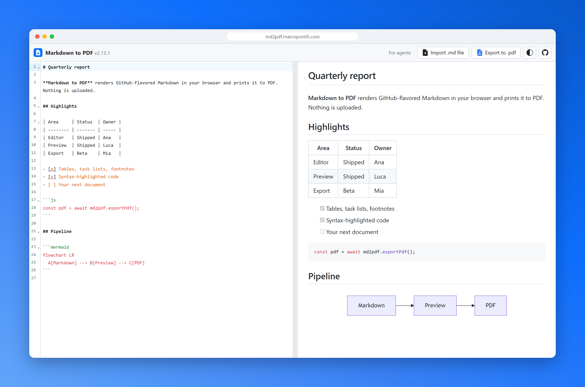

[](https://md2pdf.marcopontili.com)

# Markdown to PDF

[](https://github.com/marcop135/md2pdf/actions/workflows/ci.yml)
[](https://github.com/marcop135/md2pdf/actions/workflows/deploy.yaml)
[](https://github.com/marcop135/md2pdf/releases)
[](./LICENSE)

Write Markdown, see it rendered, save it as a PDF. Everything runs in your browser: no account, no upload, and it keeps working offline.

**Live app: [md2pdf.marcopontili.com](https://md2pdf.marcopontili.com)**

[](https://md2pdf.marcopontili.com)

## Features

- **GitHub-flavored Markdown**: tables, task lists, footnotes, and syntax-highlighted code.
- **Mermaid diagrams** from fenced `mermaid` code blocks.
- **Print-ready output** styled like GitHub, with the PDF named after the document's first heading.
- **Layout control** through allow-listed inline HTML and `<style>` blocks, for CVs and reports.
- **Works on any screen**: split editor and preview on desktop, Editor and Preview tabs on phones.
- **Installable and offline** as a PWA after the first visit.
- **Agent-ready**: coding agents drive the app through `window.md2pdf`.

## How it works

1. Type or paste Markdown, or import a `.md` file (button or drag and drop, up to 2 MB).
2. Check the live preview.
3. Click **Export to .pdf** and choose **Save as PDF** in the print dialog.

## For agents

Agents open the live app in a browser (for example with Playwriter) and call `window.md2pdf`:

| Method | Result |
| --- | --- |
| `getMarkdown()` | Current editor source |
| `setMarkdown(markdown)` | Replaces the source (string, up to 2 MB) |
| `prepareExport()` | Waits for the preview and Mermaid diagrams, sets the PDF filename |
| `exportPdf()` | `prepareExport()`, then the print dialog |

For a file without a dialog, call `prepareExport()` and save the page with the Chrome DevTools Protocol `Page.printToPDF`. Start at [`/llms.txt`](https://md2pdf.marcopontili.com/llms.txt) or [For agents](https://md2pdf.marcopontili.com/for-agents.html); maintainer notes are in [`docs/agent-surface.md`](docs/agent-surface.md). There is no hosted API: conversion always happens in the browser.

## Privacy and security

- **No backend.** Documents stay in the browser tab; nothing is sent anywhere for conversion or stored.
- **Sanitized rendering.** Raw HTML is parsed with `rehype-raw`, then `rehype-sanitize` keeps only an allow-list of tags and attributes. Scripts, event handlers, and `javascript:` links are removed.
- **Mermaid** runs with `securityLevel: 'strict'`.
- **Content Security Policy** allows scripts from the app's own origin only. Images with an `https` address in a document load from their host.
- **Hosting**: HTTPS behind Cloudflare, with HSTS, `nosniff`, `frame-ancestors 'none'`, and a strict Permissions-Policy.

Report vulnerabilities privately as described in [SECURITY.md](./SECURITY.md).

## Development

Requires Node.js 22 and npm.

```bash
git clone https://github.com/marcop135/md2pdf.git
cd md2pdf
npm install
npm start          # http://localhost:5173
```

| Command | Purpose |
| --- | --- |
| `npm start` | Dev server on port 5173 |
| `npm test` | Vitest suite |
| `npm run test:watch` | Vitest in watch mode |
| `npm run build` | Production build to `dist/` |
| `npm run preview` | Serve the production build |
| `npm run changelog:lint` | Validate `CHANGELOG.md` |
| `npm run verify:agent-readiness` | Check agent discovery files and the `window.md2pdf` wiring |
| `npm run icons:sync` | Render PWA icons from `public/favicon*.svg` |
| `npm run brand:images` | Render the README, og:image, and GitHub social images (`brand:images:check` reports stale ones) |

`dist/` deploys to any static host. On Apache, the bundled `.htaccess` sets the security and caching headers.

## Project structure

| Path | Contents |
| --- | --- |
| `src/App/Components/` | Header toolbar, editor, preview, drag bar |
| `src/App/Container/` | State and hooks (`useIsMobile`, `useDrop`) |
| `src/App/Lib/` | Agent bridge and print filename helpers |
| `public/` | `.htaccess`, manifest, robots.txt, agent discovery files |
| `docs/` | Agent surface, print filename, and changelog guides |

## Built with

React 19, Vite, CodeMirror 6, react-markdown with remark-gfm, rehype-raw and rehype-sanitize, highlight.js, Mermaid, styled-components, and vite-plugin-pwa.

## Acknowledgements

Started as a fork of [realdennis/md2pdf](https://github.com/realdennis/md2pdf) (MIT); thanks to Dennis for the original app. This version adds Mermaid, GitHub-flavored Markdown, offline support, the agent bridge, tests, and CI.

## Contributing

Read [CONTRIBUTING.md](./CONTRIBUTING.md), then [report a bug](https://github.com/marcop135/md2pdf/issues/new?template=bug.yml) or [request a feature](https://github.com/marcop135/md2pdf/issues/new?template=feature.yml). Participation follows the [Code of Conduct](./CODE_OF_CONDUCT.md).

## License

[MIT](./LICENSE)
