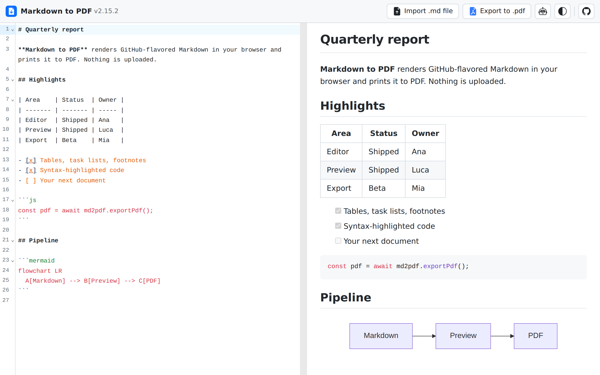
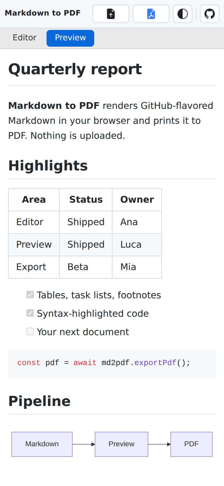

# Markdown to PDF

[](https://github.com/marcop135/md2pdf/actions/workflows/ci.yml)
[](https://github.com/marcop135/md2pdf/actions/workflows/deploy.yaml)
[](./CHANGELOG.md)
[](./LICENSE)

You have a Markdown file and need a PDF: a report, a CV, meeting notes. Open the app, paste or drop the file, and save it as a PDF. No account, no upload, no install, and it keeps working offline.

**Live app: [md2pdf.marcopontili.com](https://md2pdf.marcopontili.com)**

<p align="center">
  <picture>
    <source media="(prefers-color-scheme: dark)" srcset="docs/readme/desktop-dark.png">
    
  </picture>
  <picture>
    <source media="(prefers-color-scheme: dark)" srcset="docs/readme/mobile-dark.png">
    
  </picture>
</p>

## How it works

1. Type or paste Markdown, or import a `.md` file (button or drag and drop, up to 2 MB).
2. Watch the preview render as you type, styled like GitHub.
3. Click **Export to .pdf** and choose **Save as PDF** in the print dialog. The file is named after the document's first heading.

On small screens the editor and preview become two tabs. The app follows your system theme, or pick light or dark from the toolbar.

## What it renders

- **GitHub-flavored Markdown**: tables, task lists, footnotes, and syntax-highlighted code.
- **Mermaid diagrams** from fenced `mermaid` code blocks.
- **Layout control** through allow-listed inline HTML and `<style>` blocks, for CVs and reports.
- **Installable and offline** as a PWA after the first visit.
- **Agent bridge**: coding agents drive the app through `window.md2pdf` ([docs](docs/agent-surface.md)).

## Privacy

Documents stay in the browser tab; nothing is uploaded for conversion or stored.

## Security

Raw HTML is parsed with `rehype-raw`, then `rehype-sanitize` keeps only an allow-list of tags and attributes. Mermaid runs with `securityLevel: 'strict'`. The Content Security Policy allows scripts from the app's own origin only. Hosting is HTTPS behind Cloudflare, with HSTS, `nosniff`, `frame-ancestors 'none'`, and a strict Permissions-Policy. Report vulnerabilities as described in [SECURITY.md](./SECURITY.md).

## Built with

| Layer | Stack |
| --- | --- |
| Frontend | React 19, CodeMirror 6, react-markdown, remark-gfm, rehype-raw, rehype-sanitize, highlight.js, Mermaid, styled-components |
| Framework and build | Vite, vite-plugin-pwa (Workbox) |
| Backend | None: a static single-page app; conversion runs in the tab |
| Server | Apache behind Cloudflare, deployed from GitHub Actions |

## Development

Requires Node.js 22 and npm.

```bash
git clone https://github.com/marcop135/md2pdf.git
cd md2pdf
npm ci
npm start          # http://localhost:5173
```

| Command | Purpose |
| --- | --- |
| `npm start` | Dev server on port 5173 |
| `npm test` | Vitest suite |
| `npm run test:watch` | Vitest in watch mode |
| `npm run build` | Production build to `dist/` |
| `npm run preview` | Serve the production build |
| `npm run changelog:lint` | Validate `CHANGELOG.md` |
| `npm run verify:agent-readiness` | Check agent discovery files and the `window.md2pdf` wiring |
| `npm run icons:sync` | Render PWA icons from `public/favicon*.svg` |
| `npm run brand:images` | Render the README, og:image, and GitHub social images (`brand:images:check` reports stale ones) |
| `npm run readme:screenshots` | Recapture the README screenshots from the dev server |

`dist/` deploys to any static host. On Apache, the bundled `.htaccess` sets the security and caching headers.

## Acknowledgements

Started as a fork of [realdennis/md2pdf](https://github.com/realdennis/md2pdf) (MIT); thanks to Dennis for the original app. This version adds Mermaid, GitHub-flavored Markdown, offline support, the agent bridge, tests, and CI.

## Contributing

Read [CONTRIBUTING.md](./CONTRIBUTING.md), then [report a bug](https://github.com/marcop135/md2pdf/issues/new?template=bug.yml) or [request a feature](https://github.com/marcop135/md2pdf/issues/new?template=feature.yml).

## Author

[Marco Pontili](https://marcopontili.com)

## License

[MIT](./LICENSE)
